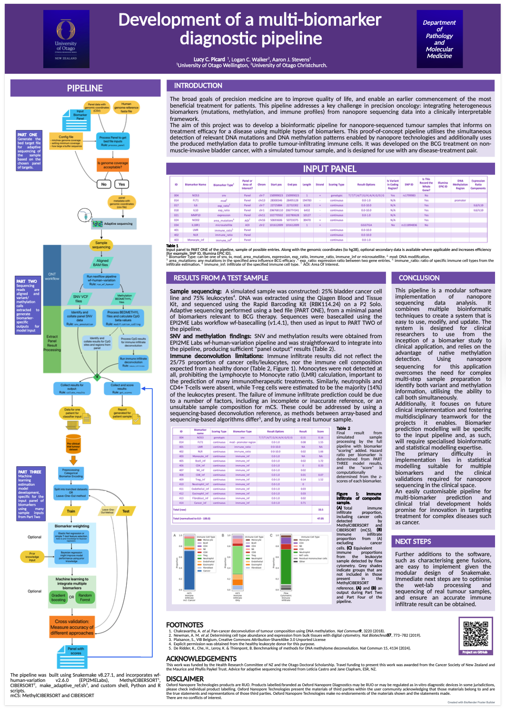

# Multi-biomarker diagnostics using nanopore sequencing technology

Kia ora!  
This is a place for additional public information about our project first presented at the Wellington NZIMLS Molecular Diagnostics SIG meeting, November 2024.  
It is now presented in a poster, for the Oxford Nanopore London Calling event, 20-22 May 2025, which I am attending in person - so excited to be there!

**Abstract:**  
The MinION device, developed by Oxford Nanopore Technologies (ONT), is a mobile-phone-sized DNA sequencing tool ideally suited for integration into diagnostic settings. This technology has the potential to simplify the entire process from patient samples to clinical results. However, bioinformatic tools need to be developed to enhance ease of use.  

Our research aims to develop a bioinformatic pipeline that informs on BCG treatment efficacy for non-muscle-invasive bladder cancer. This proof-of-concept pipeline focuses on the simultaneous detection of relevant DNA mutations and DNA methylation patterns and the tumour's profile of infiltrating immune cells, which is a pivotal factor in predicting treatment success. This multi-biomarker approach aims to create a robust panel with greater predictive accuracy than any single biomarker. The ultimate goal of this precision medicine strategy is to optimise clinical outcomes by reducing the use of BCG treatment in patients with resistant tumours, thereby minimising delays to effective alternative therapies. Designed for implementation in medical genetics laboratories, the process from tumour DNA extraction to determining BCG efficacy could be achieved within a few hours, aligning with the timeline of bladder cancer care. The applicability of this concept would be broadly adaptable to other cancers and treatments. This is particularly relevant with the growing application of targeted treatments and immunotherapies in oncology.

## Authors

* **Lucy Picard**
* Prof Logan Walker
* Dr. Aaron Stevens

## Presentations

[Multi-Biomarker Dx poster](Multi-biomarker_nanopore_poster.pdf)  
*Preview*    
    

[Multi-biomarker Dx ppt](lucypicard_multi-biom_Nov2024.pdf)  
*Preview*    
  

## Hardware, software and model versions used for analysis

* [Dorado v0.6.0](https://github.com/nanoporetech/dorado)
* *Basecalling model*: dna_r10.4.1_e8.2_400bps_sup@v4.3.0
* *5mCG and 5hmCG modified bases model*: dna_r10.4.1_e8.2_400bps_sup@v4.3.0_5mCG_5hmCG>@v1
* *6mA modified bases model*: dna_r10.4.1_e8.2_400bps_sup@v4.3.0_6mA>@v2
* [Epi2me workflow: wf-human-variation](https://github.com/epi2me-labs/wf-human-variation)
* hg38 reference genome
* tumour-immune deconvolution: [MethylCIBERSORT](https://github.com/WonyoungCho/MethylCIBERSORT)
  * Chakravarthy, A. et al. Pan-cancer deconvolution of tumour composition using DNA methylation. Nat Commun 9, 3220 (2018).

## External Links

[Lucy's GitHub Profile](https://github.com/lucy924)  
(with link to Resumé)

[Lucy's email:](mailto:lucy.picard@postgrad.otago.ac.nz)  
lucy.picard@postgrad.otago.ac.nz  

[Lucy's LinkedIn page:](www.linkedin.com/in/lucy-picard-5155b41a9)  
www.linkedin.com/in/lucy-picard-5155b41a9   

[Genomic and Epigenomic Research Lab](https://www.otago.ac.nz/wellington/research/groups/genomic-and-epigenomic-research-lab), University of Otago, Wellington.  
https://www.otago.ac.nz/wellington/research/groups/genomic-and-epigenomic-research-lab  

[Dr. Aaron Stevens Otago Profile](https://www.otago.ac.nz/gene-structure/staff/aaron-stevens)  
[Prof. Logan Walker Otago Profile](https://www.otago.ac.nz/mackenzie-cancer/staff/logan-walker)
