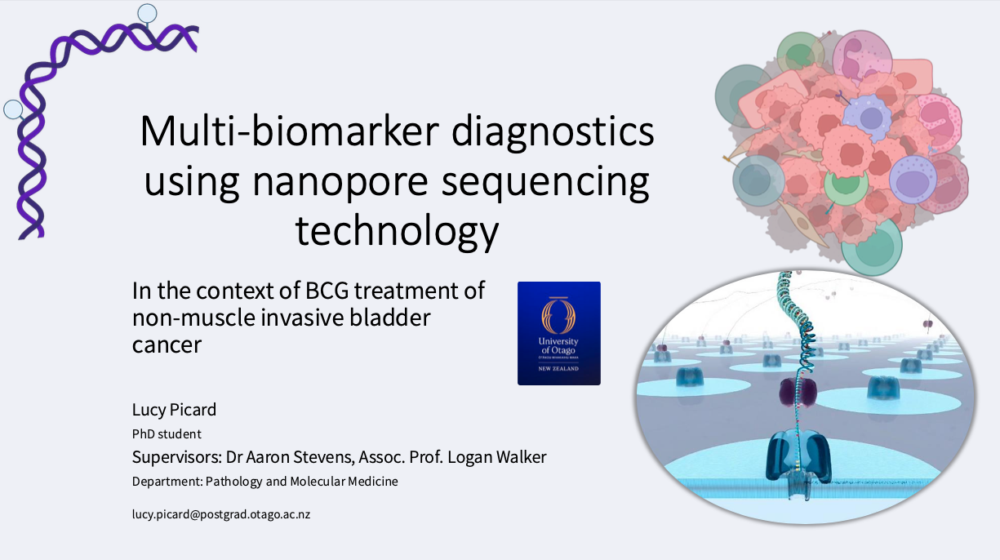

# Multi-biomarker diagnostics using nanopore sequencing technology

Kia ora!  
This is a place for additional public information about our project first presented at the Wellington NZIMLS Molecular Diagnostics SIG meeting, November 2024.

**Abstract:**  
The MinION device, developed by Oxford Nanopore Technologies (ONT), is a mobile-phone-sized DNA sequencing tool ideally suited for integration into diagnostic settings. This technology has the potential to simplify the entire process from patient samples to clinical results. However, bioinformatic tools need to be developed to enhance ease of use.  

We are developing a bioinformatic pipeline for informing BCG treatment efficacy for non-muscle-invasive bladder cancer, based on simultaneous detection of relevant DNA mutations and DNA methylation. This information also gives us critical information on the immune status of the tumour, a key component that can be used to predict treatment success. This comprehensive multi-biomarker approach, combines mutations, methylation, and immune status and offers greater potential than current single biomarker approaches. This has been developed in the context of  BCG treatment in patients with BCG-resistant tumours with the aim of decreasing the time to effective treatment, however, it is designed for easy adaptation to other diseases.

## Authors

* **Lucy Picard**
* A/Prof Logan Walker
* Dr. Aaron Stevens

## Powerpoint of project

[Multi-biomarker Dx ppt](lucypicard_multi-biom_Nov2024.pdf)  

*Preview*  
  

## Hardware, software and model versions used for analysis

* [Dorado v0.6.0](https://github.com/nanoporetech/dorado)
* *Basecalling model*: dna_r10.4.1_e8.2_400bps_sup@v4.3.0
* *5mCG and 5hmCG modified bases model*: dna_r10.4.1_e8.2_400bps_sup@v4.3.0_5mCG_5hmCG>@v1
* *6mA modified bases model*: dna_r10.4.1_e8.2_400bps_sup@v4.3.0_6mA>@v2
* [Epi2me workflow: wf-human-variation](https://github.com/epi2me-labs/wf-human-variation)
* hg38 reference genome
* tumour-immune deconvolution: [MethAtlas](https://github.com/nloyfer/meth_atlas)
  * Moss, J.; Magenheim, J.; Neiman, D.; Zemmour, H.; Loyfer, N.; Korach, A.; Samet, Y.; Maoz, M.; Druid, H.; Arner, P.; et al. Comprehensive human cell-type methylation atlas reveals origins of circulating cell-free DNA in health and disease. Nat. Commun. 2018, 9, 5068.

## External Links

[Lucy's email:](mailto:lucy.picard@postgrad.otago.ac.nz)  
lucy.picard@postgrad.otago.ac.nz  

[Lucy's LinkedIn page:](www.linkedin.com/in/lucy-picard-5155b41a9)  
www.linkedin.com/in/lucy-picard-5155b41a9   

[Department of Pathology and Moleular Medicine](https://www.otago.ac.nz/wellington/departments/pathologymolecularmedicine), University of Otago, Wellington.  
https://www.otago.ac.nz/wellington/departments/pathologymolecularmedicine  
